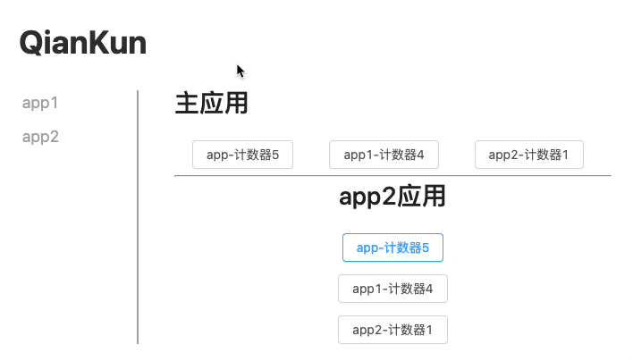

# mshared

> 1. mshared 是一个轻量的状态共享的库 （2.54kb）。。
> 2. mshared 提供了一套 react 状态管理 Api。
> 3. mshared 通过设置 globalShare，实现微前端应用之前的通信（一主多从）。

### Installation

```shell
yarn add mshared #or npm i mshared -S
```

### Example For Qiankun

1. 首先 clone `mshared`：

```shell
git clone git@github.com:juicecube/mshared.git
cd mshared
```

2. 执行 scripts 和 启动 examples project：

```shell
yarn install
yarn run example:install
yarn run start
```

Visit `http://localhost:7099`.



### Api

#### 1. Shared

```js
import { Shared } from 'mshared'

type StoreList = 'main' | 'demo' | 'partner'

export const share =
  new Shared() <
  StoreList >
  { storeName: 'main', initStore: { count: 0 }, type: 'global' }
```

| 参数      | 说明         | 默认值 | 必填                     |
| --------- | ------------ | ------ | ------------------------ |
| storeName | store 名称   | 无     | 是                       |
| initStore | store 初始值 | {}     | 否                       |
| type      | store 类型   | child  | 否（child、global 可选） |

#### 2. share.setStore(storeName, store)

```js
share.setStore('main', { count: 1 })
```

| 参数      | 说明         | 默认 | 必填 |
| --------- | ------------ | ---- | ---- |
| storeName | store 的名称 | 无   | 是   |
| store     | store 的值   | 无   | 是   |

#### 3.share.setGlobalShare(Shared)

```js
const globalShare = new Shared({
  storeName: 'global',
  initStore: { count: 0 },
  type: 'global',
})

const myShare = new Shared({
  storeName: 'myShare',
  initStore: { count: 0 },
  type: 'child',
})

myShare.share.setGlobalShare(globalShare)

const store = myShare.getStore() // store的值为{global:{count:0},myShare:{count:0}}
```

> 只允许 type 类型为 child 的支持当前方法,而且只能设置一个 globalShared

#### 4. share.getStore

```ts
const share = new Shared({
  storeName: 'main',
  initStore: { count: 0 },
  type: 'global',
})

share.setStore('main', { count: 1 })

const store = share.getStore() // store的值为{main:{count:1}}
```

> 如果 share 设置了 globalShare,则返回全局的 store，否则返回当前 share 的 store。参考`share.setGlobalShare`实例

#### 5. share.subscribe(callback)

```js
shared.subscribe((state, prevState) => {
  console.log(state, prevState)
})
```

#### 6. share.unSubscribe()

> 取消当前 share 的所有监听事件

#### 7. ShareProvider `React Api`

```jsx
import { Shared } from 'mshared'

type StoreList = 'main' | 'demo' | 'partner'

const share =
  new Shared() <
  StoreList >
  { storeName: 'main', initStore: { count: 0 }, type: 'global' }

export async function mount(props: any) {
  if (props.shared) {
    shared.setGlobalShare(props.shared)
  }

  ReactDOM.render(
    <ShareProvider shared={shared}>
      <YourApp />
    </ShareProvider>,
    props.container
      ? props.container.querySelector('#root')
      : document.getElementById('root')
  )
}
```

#### 8. useShared `React Hooks`

```js
import React from 'react'
import { useShared } from 'mshared'

export const Page = () => {
  const { store, setStore } = useShared()
  const { main } = store

  return (
    <button
      onClick={() => {
        setStore('main', { count: main.count + 1 })
      }}
    >
      计数器{main.count}
    </button>
  )
}
```

#### 9. withShared `React Hoc`

```js
import React from 'react'
import { withShared } from 'mshared'

const Page = (props) => {
  const { demo } = props.store
  return (
    <button
      onClick={() => {
        props.setStore('demo', { count: demo.count + 1 })
      }}
    >
      demo应用-计数器{demo.count}
    </button>
  )
}
export const Entry = withShared(Page)
```
